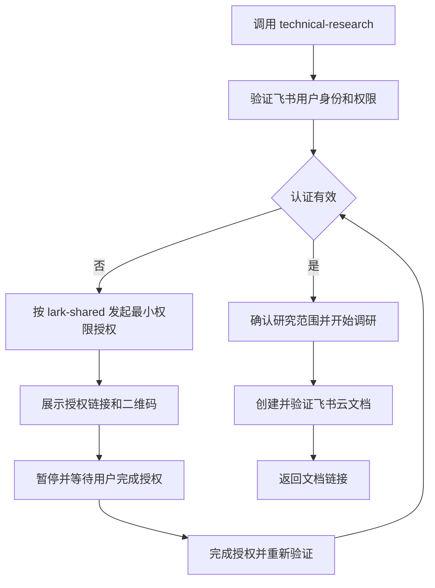

# Technical Research Skill 设计

## 背景

`technical-research-article-prompt-template.md` 用于围绕一个技术主题，综合研究学术论文、开源系统、商业产品和工业界实践。它与现有 `research-paper` skill 的单篇论文深度解读不同：前者需要建立跨来源证据链、比较多条技术路线，并从系统架构和工程落地角度形成综合判断。

本设计将该模板转换为独立的 `technical-research` skill。默认产物是面向数据库、分布式系统或 AI Infra 研发人员的中文技术调研报告，并直接创建为飞书云文档。

## 目标

- 提供可通过 `$technical-research` 调用的主题级技术调研工作流。
- 综合论文、官方文档、源码、开源系统、商业产品和公开工业实践。
- 明确区分直接事实、论文结论、官方宣称、外部证据和独立判断。
- 从架构、关键机制、正确性、性能、成本、稳定性和可运维性角度形成结论。
- 使用架构图、流程图、表格、代码或伪代码提高报告的信息密度和可读性。
- 在有效飞书用户授权下创建云文档，验证后返回文档链接。

## 非目标

- 不替代 `research-paper` 对单篇论文正文、实验和附录的完整批判性解读。
- 不默认写成面向大众的科普或公开传播文章；只有用户明确要求时才切换表达方式。
- 不将 Markdown 文件作为正常的最终交付或未授权时的降级结果。
- 不使用二手文章证明源码实现、商业产品内部机制或正确性语义。
- 不为满足形式要求生成无信息量的装饰图。
- 本阶段不设计提交、推送或 PR 流程。

## 仓库结构

```text
skills/technical-research/
├── SKILL.md
├── agents/
│   └── openai.yaml
├── references/
│   ├── evidence-and-sources.md
│   ├── database-and-systems.md
│   ├── paper-and-product-review.md
│   └── feishu-delivery.md
└── assets/
    └── report-outline.md

prompt_templates/technical-research/
└── prompt_template.md
```

当前不创建 `scripts/`。认证、文档创建、图片上传和画板编辑复用现有飞书能力；只有后续出现重复且适合机械验证的操作时，才增加脚本。

## 组件职责

### `SKILL.md`

保留核心编排：认证门禁、范围确认、检索计划、证据账本、分轨分析、综合写作、图形设计、飞书创建和交付验证。正文保持精简，通过直接链接按需加载 references 和 asset。

frontmatter 的 `description` 必须同时说明：

- 研究对象是一个技术主题，而非只解读一篇论文；
- 适用于数据库、分布式系统、AI Infra、存储、查询优化和系统软件等主题；
- 需要综合论文、官方资料、源码、开源项目和工业产品；
- 默认创建中文飞书云文档。

### `agents/openai.yaml`

只包含 `display_name`、`short_description` 和 `default_prompt`。建议显示名称为“技术主题深度调研”，默认提示词明确要求围绕给定主题创建飞书云文档调研报告。

### `references/evidence-and-sources.md`

定义一手来源优先级、纳入与排除标准、时间敏感事实核验、来源冲突处理、引用粒度、定量证据追踪和证据不足时的结论收缩规则。

### `references/database-and-systems.md`

仅在主题相关时读取，覆盖数据库与系统软件的专用分析维度：逻辑与物理架构、数据模型、存储、查询优化与执行、事务与一致性、复制与恢复，以及写入、存储、执行、事务和分布式性能链路。

### `references/paper-and-product-review.md`

定义代表性论文选择、技术路线分组、实验结果压缩总结、开源项目与商业产品的证据边界，以及 API、框架、引擎、数据库和完整基础设施的分层比较方法。

### `references/feishu-delivery.md`

定义飞书认证、长文档分段写入、XML 组件选型、画板与本地图片插入、失败恢复、创建后回读和最终交付验证。具体命令和认证细节引用当前 `lark-shared`、`lark-doc` 和需要时的 `lark-whiteboard`，不在新 skill 中复制易变化的 CLI 说明。

### `assets/report-outline.md`

提供可裁剪的报告骨架。它是输出资产，不是必须逐章填满的固定问卷。

### `prompt_templates/technical-research/prompt_template.md`

从用户提供的模板演化而来，保留输入变量、研究问题、来源要求和数据库增强维度；删除与 skill 编排重复的冗长说明。该文件仍是可以独立复制使用的提示词入口，但不成为 `SKILL.md` 的重复实现。

## 认证状态机

飞书认证是研究任务的前置门禁。



规则如下：

- 默认使用用户身份创建文档。
- 未登录、令牌过期或权限不足时，遵循 `lark-shared` 的分步授权流程。
- 发起授权后暂停任务，用户返回后由 agent 完成授权并重新验证。
- 不把令牌、授权链接或设备码写入仓库或研究产物。
- 授权有效前不执行完整调研，避免最终交付不可完成。
- 写入时若发现新的明确缺失权限，只申请错误信息指出的最小权限，再恢复原任务。

## 输入契约与默认值

唯一必填输入是技术主题。可选输入包括时间范围、重点论文、重点产品、目标读者、分析维度、目标长度和文档位置。

默认行为：

- 使用中文写作，保留必要的英文术语和项目名称。
- 面向数据库、分布式系统或 AI Infra 研发人员。
- 不限制历史起点，重点核验最近三至五年的发展。
- 同时覆盖代表性学术研究、开源系统和工业产品。
- 以架构、关键机制、正确性、性能、成本和工程落地为主要评价维度。
- 创建到当前飞书用户默认可写位置。
- 篇幅由主题复杂度决定，不机械追求固定字数。

只有缺失信息会实质改变研究范围或结论时才追问；否则采用默认值，并在报告中声明范围和时间截点。

## 研究工作流

### 1. 建立研究契约

在检索前定义工作定义、核心问题、相邻技术边界、研究对象、评价维度、时间截点和非目标。对于尚无统一定义的新兴术语，先比较不同论文和产品的定义，再给出本文采用的工作定义。

### 2. 制定检索与纳入标准

来源优先级为：

1. 论文正文、附录和补充材料；
2. 官方文档、规格、源码、发布说明和项目仓库；
3. 官方工程博客、公开演讲和设计文档；
4. 独立基准、复现报告或可信技术分析；
5. 只作为检索线索的二手综述。

纳入来源必须与核心问题直接相关，身份、版本和日期可确认，并能支持具体事实、机制或比较结论。排除无法定位原始出处、只复述营销文案、版本不明且影响结论、只有关键词关联或重复转载的材料。

### 3. 建立证据账本

每条关键主张记录：

| 字段 | 含义 |
| --- | --- |
| Claim | 准备写入报告的主张 |
| Evidence class | 直接事实、论文结论、官方宣称、外部证据或独立判断 |
| Source | 原始来源链接或文件 |
| Location | 页码、章节、源码位置、文档段落或版本 |
| Time/version | 对应版本和核验日期 |
| Confidence | 高、中或低 |
| Conflict | 是否存在相互冲突的来源 |
| Usage | 将用于报告的章节 |

定量结果必须保留数据集、工作负载、基线、指标和实验条件。未公开的商业系统内部机制只能标记为推断。来源冲突必须并列呈现，证据不足时缩小结论。

### 4. 分轨分析

1. 概念与历史：问题背景、定义变化、技术路线和演进原因。
2. 机制与架构：组件、数据流、控制流、算法、数据结构和运行过程。
3. 学术研究：代表性论文、实验可信度、创新点和适用边界。
4. 系统与产品：开源实现、商业能力、接口、成熟度和生产约束。
5. 综合判断：差异根因、架构选择、落地条件、风险和未来方向。

论文优先按技术路线、问题分解或架构代际组织，不按发表时间简单罗列。

### 5. 综合写作

从证据账本生成正文。先给结论，再解释证据和推导过程；每章回答“为什么这样设计、解决了什么、代价是什么”。功能差异必须追溯到架构、数据模型、算法或工程约束。当前事实与未来判断分开，研究缺口单独列出。

## 默认报告结构

1. 标题、导语、范围和时间截点；
2. 核心结论、推荐选择及成立条件；
3. 问题背景、工作定义与技术边界；
4. 整体架构、组件、状态和关键数据流；
5. 核心机制、算法、正确性和性能路径；
6. 技术路线与代表性论文；
7. 开源系统与工业产品；
8. 横向比较及差异根因；
9. 工程落地、可观测性、成本和阶段路径；
10. 风险、局限与未解决问题；
11. 未来演进判断；
12. 总结、参考资料和证据说明。

报告开头必须给结论；证据不足时直接说明无法支持唯一方案，不制造明确推荐。

## 图形与代码策略

对于数据库、分布式系统、AI Infra 或系统软件主题，默认至少包含：

- 一幅整体架构图；
- 一幅请求流、数据流、执行流或状态流图；
- 一张代表性方案比较表；
- 一个代码、伪代码、SQL、执行计划、配置或协议交互代码块；
- 一份风险或适用边界清单。

若某种形式与主题不匹配，可替换为更准确的状态机、时序图或其他表达，并说明原因。

图形使用混合策略：

| 内容 | 默认形式 |
| --- | --- |
| 系统组件与边界 | 飞书画板或 Mermaid 架构图 |
| 请求流、数据流和状态流 | 飞书画板或 Mermaid 流程图 |
| 算法和协议 | 伪代码、时序图或状态机 |
| 实验结果 | 根据可追溯原始数据重绘的图表 |
| 多方案比较 | 飞书原生表格 |
| 源码和配置 | 原生代码块 |

每幅图必须有标题、明确的视觉语义、图注、数据或设计依据，以及来源或“根据资料整理、作者重绘”的声明。推断内容必须显式标记。无法可靠重绘或确认使用许可时，改用表格或文字，不复制第三方图片。

真实代码使用准确的语言标识，伪代码使用 `text`。代码前说明输入和目的，代码后解释输出、状态变化和边界条件。引用源码时给出仓库、版本、文件位置和链接。

## 飞书写入策略

最终产物是原生飞书云文档，默认使用飞书 XML 表达正文，不先生成 Markdown 再导入。长文档按以下顺序分阶段写入：

1. 创建标题和章节骨架；
2. 按章节依次插入正文；
3. 插入表格、引用块和代码块；
4. 创建画板或上传本地图片；
5. 调整图形位置并添加图注；
6. 写入参考资料和证据说明；
7. 重新读取并验证。

本地生成的 PNG 保存在临时工作目录。先创建正文锚点，再上传图片、移动图片 block、补充图注；验证成功后清理临时文件。图片或画板写入失败时，文档不能被标记为完成。

## 面向大众的可选模式

只有用户明确要求对外发布或面向大众时才切换：解释缩写和术语，在机制前增加直观例子，将过长实现细节移入附录，并调整标题、导语和章节过渡。证据标准、正确性分析、限制条件和不确定性不得因此删除。

## 失败与恢复语义

- 授权中断：用户完成授权后从身份验证继续。
- 单个来源不可访问：寻找官方镜像或替代一手来源，并记录证据缺口。
- 产品信息不可验证：保留为官方宣称或从比较中移除。
- 创建失败：不返回虚假链接，修复后重试。
- 章节写入失败：继续修复同一文档，避免重复创建残缺副本。
- 文档不可恢复：说明原因后再创建新文档。
- 图片或画板失败：报告具体对象，缺图版本不视为完成。
- 无法完成运行时或源码验证：明确标记未验证，不把静态材料升级为实现事实。

## 完成与验证标准

### Skill 静态验证

- 使用官方 skill validator 检查 frontmatter、名称和目录一致性。
- 确认 `agents/openai.yaml` 与最终 `SKILL.md` 匹配，且只包含支持的字段。
- 检查 `SKILL.md` 对所有 references 和 asset 的路径均有效。
- 检查 prompt template 与 skill 的研究边界、来源要求和飞书交付契约一致。
- 运行 `git diff --check` 并确认变更仅属于当前任务。

### 行为前向验证

实现完成后使用至少三个代表性请求进行独立前向验证：

1. 数据库或查询优化主题；
2. 分布式系统或存储主题；
3. AI Infra 或非数据库系统主题。

验证 skill 是否正确触发、是否与 `research-paper` 分流、是否先处理飞书授权、是否建立跨来源证据链，以及是否创建包含有效图形和引用的飞书文档。前向验证不得预先泄露预期答案。

### 飞书文档验证

创建后重新读取文档并检查：

- 标题和章节层级完整，无重复段落；
- 表格、代码块、图片和画板存在且位于正确章节；
- 不存在临时锚点、占位符或未替换变量；
- 关键数字和比较有就近来源；
- 论文结论、官方宣称和独立判断明确区分；
- 推荐方案写明成立条件，风险和证据缺口未被省略；
- 当前用户身份能够读取文档。

只有文档实际创建、回读验证通过、无未报告的部分失败，并在最终回复中返回飞书链接时，任务才算完成。
